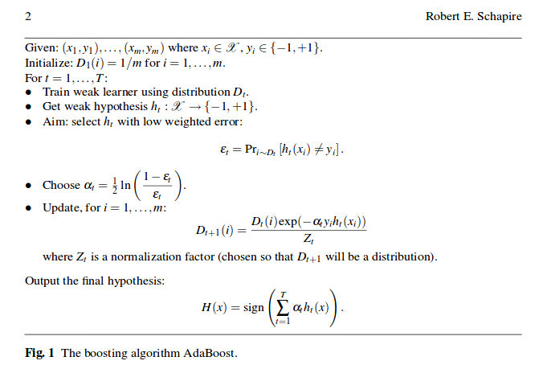

# **Implementation of Adaboost Algorithm**

## **Brief Explanation**

Boosting is a type of tree-based method which tries to predict the target variables using various relatively weak and inaccurate rules(trees).
There are various types of boosting techniques available but here only AdaBoost is our focus.Check-out the other folders in the parent tree for explanation of other boosting methods.
This post will only explain the math necessary to understand the algorithm and its intuition.If you want to know everything about how the techniques was developed and its theoriticak proof,head [here][link].

## *Pseudo-code explanation*

Dt : Weight Distribution of target variable in tth tree.

**Pri~Dt**\[ht(xi)\](&epsilon;) : Sum over the full data of the weighted error between the predicted target of tth tree and the real target.

Here &epsilon; should be lower than random guessing error i.e. 1/2. For better 

### **Papers and blogposts referenced**
* [Brief Introduction to AdaBoost](http://rob.schapire.net/papers/explaining-adaboost.pdf)
* [link]: https://.lin.prg
